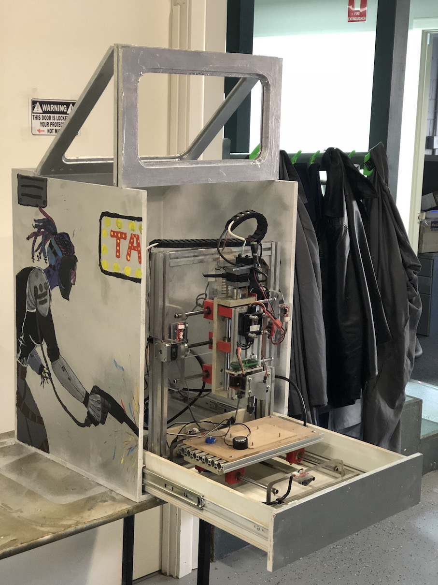

# Wensleydale - A cabinet for 3D printers and CNC machines

# What, why?

In winter, my FDM 3D printers give poor results due to inability to
keep the part warm.    Also, my CNC mill is REALLY LOUD.

So I wanted a cabinet to cut down heat loss and/or noise.

A friend asked could I make a kit, so I wrote a program to generate 
a parts list at any size.

I wanted to name the project after the robot antagonist in "A Grand
Day Out" but I discovered it was unnamed.   So I made up a name.

# How to make your cabinet

Enter your sizes into the SCAD file, and render the drawing.

The console window will now contain instructions for cutting and
routing your pieces.

Consult the assembled view and attached photographs for instructions.

A brad nailer and PVA glue works well.   Nails or screws work too.

It's possible to make the cabinet with just a jigsaw, drill and
router. A table saw or other circular saw makes it painless.

If you have a CNC router that can cut plywood or MDF, then you 
could use that.

Artwork by my son, Jack Fletcher.

